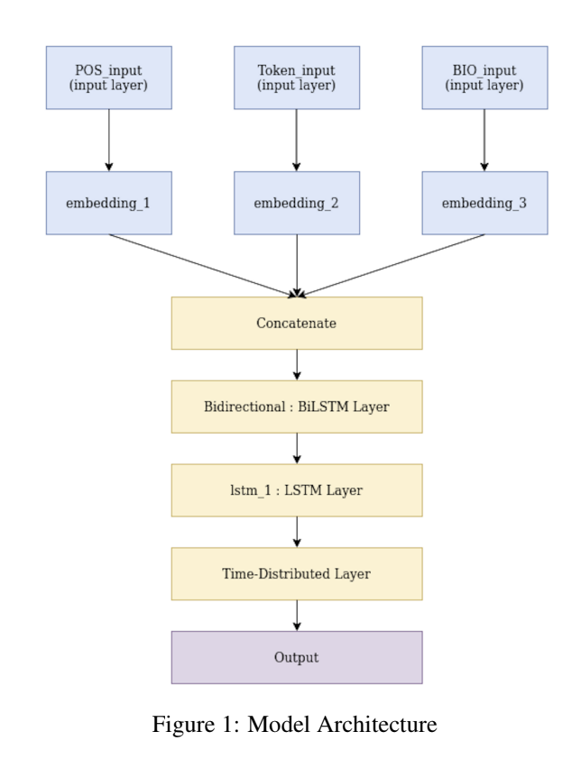

# Semantic Role Labelling using BiLSTM on Nombank-Dataset
- Developed a deep learning model for Argument Prediction (object and subject) of a sentence given a predicate on [Nombank Dataset](https://nlp.cs.nyu.edu/meyers/NomBank.html); based on dependency mappings and POS tags; used Tensorflow library for training on cloud GPUs.
- Reviewed literature and devised an approach using BiLSTM for classification.

## Project Details
- The cleaned version data of % class from the nombank dataset is used here. However, this project can be used for any other class of nombank as well.
- The dataset `%_nombank.clean.train` is shared.
- `Token Embeddings`, `POS embeddings` and `BIO embeddings` of each sentence are concatenated.
- This concatenated input is given to `BiLSTM` model.
- The model outputs 2 tags `Arg1` or `Not Arg1`.

